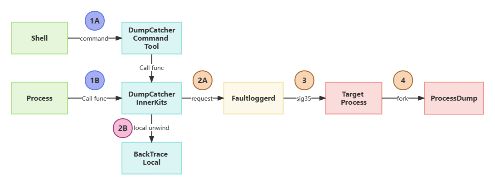

# FaultLoggerd组件

## 简介

Faultloggerd部件是OpenHarmony中C/C++运行时崩溃临时日志的生成及管理模块。面向基于 Rust 开发的部件，Faultloggerd 提供了Rust Panic故障日志生成能力。系统开发者可以在预设的路径下找到故障日志，定位相关问题。

## 架构


* Native InnerKits 接口
  * SignalHandler：信号处理器，接收系统异常信号，触发抓取进程异常时的现场信息。
  * BackTrace：本地回栈库，提供进程内本地回栈能力。
  * DumpCatcher：堆栈信息抓取工具库，提供了抓取指定进程和线程的堆栈信息的能力。
  * FaultloggerdClient：崩溃临时日志管理客户端，接收申请文件描述符、堆栈导出等请求。
* Rust 接口
  * PanicHandler：Rust PANIC故障处理器，封装faultloggerd回栈能力支持rust模块PANIC故障回栈。
  * Rustc Demangle：Rust 符号demangle库，支持Rust模块mangled符号解析。
* Faultlogger Daemon 服务
  * FaultloggerdServer：核心服务处理模块，接收并处理客户端的请求。
  * FaultloggerdSecure：权限校验模块，对运行时崩溃日志生成和抓取提供权限管理和校验能力。
  * FaultloggerdConfig：崩溃临时日志管理模块。
  * FaultloggerdPipe：数据管道传输管理模块，提供数据传输管道申请和管理能力。
* 工具
  * DumpCatcher Command Tool：提供命令行形式的主动抓栈工具，仅在Debug版本提供。
  * ProcessDump：进程信息抓取二进制工具，通过命令行方式提供抓取指定进程、线程堆栈信息的能力。
  * crasher：崩溃构造器，提供了崩溃构造和模拟能力。
  * Rust Panic Maker：Rust PANIC 故障构造器，提供了构造Rust模块的故障构造能力。

目前主要支持对以下C/C++运行时崩溃异常信号的处理：

| 信号值 | 信号      | 解释            | 触发原因                                                     |
| ------ | --------- | --------------- | ------------------------------------------------------------ |
| 4      | SIGILL    | 非法指令        | 执行了非法指令，通常是因为可执行文件本身出现错误，或者试图执行数据段，堆栈溢出时也有可能产生这个信号。 |
| 5      | SIGTRAP   | 断点或陷阱异常  | 由断点指令或其它trap指令产生。                               |
| 6      | SIGABRT   | abort发出的信号 | 调用abort函数生成的信号。                                    |
| 7      | SIGBUS    | 非法内存访问    | 非法地址，包括内存地址对齐（alignment）出错。比如访问一个四个字长的整数，但其地址不是4的倍数。它与SIGSEGV的区别在于后者是由于对合法存储地址的非法访问触发的（如访问不属于自己存储空间或只读存储空间）。 |
| 8      | SIGFPE    | 浮点异常        | 在发生致命的算术运算错误时发出，不仅包括浮点运算错误，还包括溢出及除数为0等其它所有的算术的错误。 |
| 11     | SIGSEGV   | 无效内存访问    | 试图访问未分配给自己的内存，或试图往没有写权限的内存地址写数据。 |
| 16     | SIGSTKFLT | 栈溢出          | 堆栈溢出。                                                   |
| 31     | SIGSYS    | 系统调用异常    | 非法的系统调用。                                             |

## 目录

```txt
faultloggerd/
├── OAT.xml
├── common                                 # 工具库和公共定义
├── docs                                   # 文档
├── example                                # 样例代码
├── frameworks                             # 主动抓栈实现
├── interfaces
│   ├── innerkits
│   │   ├── backtrace                      # 本地回栈库
│   │   ├── dump_catcher                   # 抓取调用栈基础库
│   │   ├── faultloggerd_client            # 崩溃临时日志管理服务客户端接口
│   │   └── signal_handler                 # 异常信号处理器
│   └── rust
│       ├── panic_handler                  # Rust Panic 处理器
│       ├── panic_report                   # Rust Panic 故障上报库
│       └── rustc_demangle                 # Rust demangle 库
├── services                               # faultloggerd 常驻服务
├── test
│   ├── funchook                           # hook 工具测试用例
│   ├── fuzztest                           # 模糊测试用例
│   ├── moduletest                         # 模块测试用例
│   ├── performancetest                    # 性能测试用例
│   ├── systemtest                         # 系统测试用例
│   └── unittest                           # 单元测试用例
└── tools
    ├── crasher_c                          # 崩溃构造器（C）
    ├── crasher_cpp                        # 崩溃构造器（C++）
    ├── dump_catcher                       # DumpCatcher 命令行工具
    ├── panic_maker                        # Rust Panic 故障构造器
    └── process_dump                       # 崩溃抓栈实现
```

## 使用说明

### 进程崩溃日志生成

目前已默认开启，进程因上述异常信号崩溃将会在设备 `/data/log/faultlog/temp` 目录下生成完整的崩溃日志，可基于该崩溃日志进行问题定位和分析。

> 崩溃日志介绍和常见问题指南参见：[faultloggerd FAQ](docs/usage.md)

### DumpCatcher 接口

DumpCatcher是提供给第三方模块使用的抓取调用栈基础库，其中包含了打印指定进程（或线程）的栈信息的接口函数。目前支持CPP调用栈和CPP-JS混合栈。

接口类名：`DfxDumpCatcher`

接口定义：
* 默认（支持混合栈）：`bool DumpCatch(int pid, int tid, std::string& msg);`
* 支持输出到指定文件：`bool DumpCatchFd(int pid, int tid, std::string& msg, int fd);`
* 支持批量抓栈：`bool DumpCatchMultiPid(const std::vector<int> &pids, std::string& msg);`

接口参数说明：
* 接口返回值：
  * `true`：回栈成功，回栈信息存储在`msg`字符串对象中；
  * `false`：回栈失败。
* 输入参数：
  * `pid`：希望回栈的进程号，如果需要回栈进程中的所有线程，则`tid`设定为`0`；
  * `tid`：希望回栈的线程号；
  * `fd`：指定写入回栈信息的文件句柄；
* 输出参数：
  * `msg`：如果回栈成功，则通过`msg`输出回栈后的信息。

> 注意：此接口需要调用者是管理员（system，root）用户，或者只抓取自己用户拥有的进程信息。

样例代码：

* dump_catcher_demo.h

```c++
#ifndef DUMP_CATCHER_DEMO_H
#define DUMP_CATCHER_DEMO_H

#include <inttypes.h>

#define NOINLINE __attribute__((noinline))

#define GEN_TEST_FUNCTION(FuncNumA, FuncNumB)          \
    __attribute__((noinline)) int TestFunc##FuncNumA() \
    {                                                  \
        return TestFunc##FuncNumB();                   \
    }

// test functions for callstack depth test
int TestFunc0(void);
int TestFunc1(void);
int TestFunc2(void);
int TestFunc3(void);
int TestFunc4(void);
int TestFunc5(void);
int TestFunc6(void);
int TestFunc7(void);
int TestFunc8(void);
int TestFunc9(void);
int TestFunc10(void);

#endif // DUMP_CATCHER_DEMO_H
```

  * dump_catcher_demo.cpp

```c++
#include "dump_catcher_demo.h"

#include <iostream>
#include <string>
#include <unistd.h>
#include "dfx_dump_catcher.h"
using namespace std;

NOINLINE int TestFunc10(void)
{
    OHOS::HiviewDFX::DfxDumpCatcher dumplog;
    string msg = "";
    bool ret = dumplog.DumpCatch(getpid(), gettid(), msg);
    if (ret) {
        cout << msg << endl;
    }
    return 0;
}

// auto gen function
GEN_TEST_FUNCTION(0, 1)
GEN_TEST_FUNCTION(1, 2)
GEN_TEST_FUNCTION(2, 3)
GEN_TEST_FUNCTION(3, 4)
GEN_TEST_FUNCTION(4, 5)
GEN_TEST_FUNCTION(5, 6)
GEN_TEST_FUNCTION(6, 7)
GEN_TEST_FUNCTION(7, 8)
GEN_TEST_FUNCTION(8, 9)
GEN_TEST_FUNCTION(9, 10)

int main(int argc, char *argv[])
{
    TestFunc0();
    return 0;
}
```

* BUILD.gn：

```gn
import("//base/hiviewdfx/faultloggerd/faultloggerd.gni")
import("//build/ohos.gni")

config("dumpcatcherdemo_config") {
  visibility = [ ":*" ]

  include_dirs = [
    ".",
    "//utils/native/base/include",
    "//base/hiviewdfx/faultloggerd/interfaces/innerkits/dump_catcher/include/",
  ]
}

ohos_executable("dumpcatcherdemo") {
  sources = [ "dump_catcher_demo.cpp" ]

  configs = [ ":dumpcatcherdemo_config" ]

  deps = [
    "//base/hiviewdfx/faultloggerd/interfaces/innerkits/dump_catcher:libdfx_dumpcatcher",
    "//utils/native/base:utils",
  ]

  external_deps = [ "hilog:libhilog" ]

  install_enable = true
  part_name = "faultloggerd"
  subsystem_name = "hiviewdfx"
}
```

* 执行结果：

```txt
# ./dumpcatcherdemo
#00 pc 0000000000000981(00000000004a8981) /data/test/dumpcatcherdemo
#01 pc 0000000000000a6d(00000000004a8a6d) /data/test/dumpcatcherdemo
#02 pc 0000000000000a63(00000000004a8a63) /data/test/dumpcatcherdemo
#03 pc 0000000000000a59(00000000004a8a59) /data/test/dumpcatcherdemo
#04 pc 0000000000000a4f(00000000004a8a4f) /data/test/dumpcatcherdemo
#05 pc 0000000000000a45(00000000004a8a45) /data/test/dumpcatcherdemo
#06 pc 0000000000000a3b(00000000004a8a3b) /data/test/dumpcatcherdemo
#07 pc 0000000000000a31(00000000004a8a31) /data/test/dumpcatcherdemo
#08 pc 0000000000000a27(00000000004a8a27) /data/test/dumpcatcherdemo
#09 pc 0000000000000a1d(00000000004a8a1d) /data/test/dumpcatcherdemo
#10 pc 0000000000000a13(00000000004a8a13) /data/test/dumpcatcherdemo
#11 pc 0000000000000a77(00000000004a8a77) /data/test/dumpcatcherdemo
#12 pc 00000000000c2b08(00000000b6fafb08) /system/lib/ld-musl-arm.so.1(__libc_start_main+116)
#13 pc 0000000000000938(00000000004a8938) /data/test/dumpcatcherdemo
#14 pc 00000000000008c4(00000000004a88c4) /data/test/dumpcatcherdemo
```

### DumpCatcher 命令行工具

DumpCatcher 是指提供给用户的一个抓取调用栈命令行工具，由 DumpCatcher innerkits 接口封装实现，该工具通过 `-p`、`-t` 参数指定进程和线程，命令执行后在命令行窗口打印指定的进程的线程栈信息。

工具名称：`dumpcatcher`

位置：`/system/bin`

参数说明：

* `-p [pid]`：打印指定进程下面的所有线程栈信息；
* `-p [pid] -t [tid]`：打印指定进程下面的指定线程信息。

返回打印说明：如果栈信息解析成功，则将信息显示到标准输出。

> 注意：使用此接口需要调用者是管理员（system，root）用户。

### Rust Panic 故障处理器

> TODO

## 处理流程

### 进程崩溃抓栈处理流程


1. 进程运行时异常崩溃后会收到来自 `Kernel` 发送的崩溃信号，由进程在启动加载的 `SignalHandler` 模块进行信号处理；
2. 进程接收到崩溃信号后，保存当前进程上下文，fork 出子进程执行 `ProcessDump` 二进制进行抓栈；
3. `ProcessDump` 向 `Faultloggerd` 申请文件句柄用于存储收集到的崩溃日志数据；
4. `ProcesDump` 将完整崩溃日志数据写入到 `/data/log/faultlog/temp` 目录下进行临时存储；
5. `ProcessDump` 收集完崩溃日志后，上报给 `Hiview` 进行后续处理；
4. `Hiview` 接收到新增进程崩溃故障数据后，提取简易的崩溃日志存储到 `/data/log/faultlog/faultlogger` 目录下，并生成 `HiSysevent` 故障事件。

### DumpCatcher 接口/命令行工具 主动抓栈处理流程



1. 进程A调用`DumpCatcher`库提供的系列接口（1B），或通过 `DumpCatcher` 命令行工具(1A)，申请dump指定进程和线程的堆栈信息；
2. 如果目前进程是当前进程，则直接调用 `BackTrace Local` 提供的能力进行本地回栈输出（2B）；如果不是，则向 `Faultloggerd` 服务发送抓栈请求（2A）；
3. `Faultloggerd` 接收到抓栈请求，通过鉴权和管道申请等操作后，向目标进程发送 `SIGDUMP(35)` 信号触发主动抓栈（3）；
4. 目前进程接收到 `SIGDUMP(35)` 抓栈信号后，保存当前进程上下文，fork出子进程执行 `ProcessDump` 二进制进行抓栈，通过 `Faultloggerd` 申请到的管道返回调用栈数据（4）。

### Rust Panic 故障日志收集流程

// TODO

## 相关仓

[DFX子系统](https://gitee.com/openharmony/docs/blob/master/zh-cn/readme/DFX%E5%AD%90%E7%B3%BB%E7%BB%9F.md)

[hiviewdfx\_hiview](https://gitee.com/openharmony/hiviewdfx_hiview/blob/master/README_zh.md)

[hiviewdfx\_hilog](https://gitee.com/openharmony/hiviewdfx_hilog/blob/master/README_zh.md)

[hiviewdfx\_hiappevent](https://gitee.com/openharmony/hiviewdfx_hiappevent/blob/master/README_zh.md)

[hiviewdfx\_hisysevent](https://gitee.com/openharmony/hiviewdfx_hisysevent/blob/master/README_zh.md)

**hiviewdfx\_faultloggerd**

[hiviewdfx\_hilog\_lite](https://gitee.com/openharmony/hiviewdfx_hilog_lite/blob/master/README_zh.md)

[hiviewdfx\_hievent\_lite](https://gitee.com/openharmony/hiviewdfx_hievent_lite/blob/master/README_zh.md)

[hiviewdfx\_hiview\_lite](https://gitee.com/openharmony/hiviewdfx_hiview_lite/blob/master/README_zh.md)

